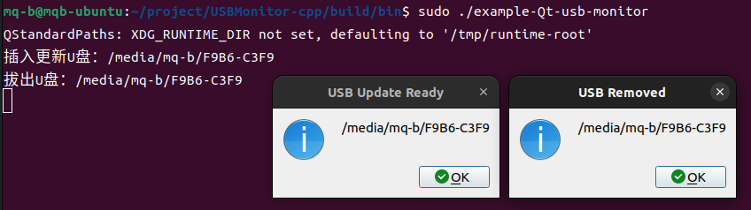

# USBMonitor-cpp

`USBMonitor-cpp` 是一个用 C++17 编写的开源项目，提供了一个用于实时监控 USB 设备插拔状态的库。

它十分的简单，通过开启一个线程时刻监控 Linux 中外部存储设备默认挂载路径来发送信号。

而 windows 中，它使用了一个 Windows API `GetDriveTypeA` 来获取当前所有驱动器进行监控。

> [!NOTE]
> `USBMonitor-cpp` 是一个**纯头文件库**，你只需要将 include 文件夹的内容复制到自己项目目录即可使用。

## 构建

```shell
git clone https://github.com/Mq-b/USBMonitor-cpp
cd USBMonitor-cpp
mkdir build
cd build
cmake ..
cmake --build . -j
```

会在 `build` 目录下生成编译好的 `example` 可执行文件。

在 Ubuntu22.04 中使用 GCC11、GCC12、GCC13 测试无误。



在 windows 使用 visual studio 17 测试无误。


---

如果需要如 wsl 之类的无桌面的 Linux 系统需要显式挂载外部存储设备进行测试，则可以这样：

```shell
# 挂载外部存储这个 E 是 windows 中盘符
mount -t drvfs E: /media/A/E

# 手动拔出设备后解除挂载点
sudo umount /media/A/E
# 删除文件夹
sudo rm -rf /media/A/E
```

```txt
root@Mq-B:~/test/USBMonitor-cpp/build/bin# sudo ./example-usb-monitor
插入更新U盘：/media/A/E
USB Update Ready: /media/A/E
拔出U盘：/media/A/E
USB Removed: /media/A/E
```

如果是完整的带桌面的系统会自动处理挂载和卸载。
